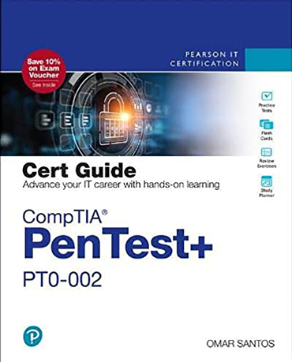

<h6>Ver. Aug-2022.</h6>
<h2> CS-435 "Ethical Hacking" </h2>
<h4 style="color:green"><i> Prof. Sangmork "SAM" Park (Col(R). ROKAF)</i></h4>
<h5><u><i>School of Arts and Science, Carolina University</i></u></h5>

<h4>Textbook:</h4> 

<em><u>[Omar Santos, 2022. "CompTIA PenTest+, PT0-002", Pearson](https://www.pearson.com/en-us/subject-catalog/p/comptia-pentest-pt0-002-cert-guide/P200000000589/9780137921065)</u></em>

<h4>Prerequisites:</h4>

-   Fundamental knowledge of Computer Systems, Networking, Database, Web Services/Applications, Linux, Cryptography, and Web Programming.
-   Basic skills on Programming (Python and Shell Scripting required, Perl and Ruby recommended )

---

<h4>Course description</h4>

-   This course goes into the how and why Ethical Hacking (Penetration Testing) is conducted, and how it is used to strengthen the information security systems.
-   This course helps students to prepare for the <em><u>[CompTIA PenTest+ Certification Exam.](https://www.comptia.org/certifications/pentest)</u></em>

---

<h4>Course Schedule</h4>

<h5>Week-1: </h5>

-   Intro. to Ethical Hacking and Penetration Testing
-   Planning and Scoping a Penetration Testing Assessment
-   Quiz#1, Report#1 (OWASP Juice-Shop)

<h5>Week-2: </h5>

-   Information Gathering and Vulnerability Scanning-1
-   Information Gathering and Vulnerability Scanning-2
-   Quiz#2, Project#1 (Lab environment setup)

<h5>Week-3: </h5>

-   Social Engineering Attacks
-   Exploiting Wired and Wireless Networks-1
-   Quiz#3, Report#2 (SEC tool & Web application vulnerability test: OWASP Juice-Shop)

<h5>Week-4: </h5>

-   Exploiting Wired and Wireless Networks-2
-   Exploiting Application-Based Vulnerabilities-1
-   Mid-term exam, Report#3 (WireShark & Web application vulnerability test: OWASP Juice-Shop)

<h5>Week-5: </h5>

-   Exploiting Application-Based Vulnerabilities-2
-   Cloud, Mobile, and IoT Security
-   Quiz#4, Report#4 (Web application vulnerability test: OWASP Juice-Shop)

<h5>Week-6: </h5>

-   Performing Post-Exploitation Techniques
-   Reporting and Communication
-   Quiz#5, Report#5 (Web application vulnerability test: OWASP Juice-Shop)

<h5>Week-7: </h5>

-   Tools and Code Analysis-1
-   Tools and Code Analysis-2
-   Final exam, Final Project/Report

---

<h4>References</h4>

1. [NIST CSRC: Computer Security Resource Center](https://csrc.nist.gov/)
2. [MITRE Cybersecurity Area](https://www.mitre.org/focus-areas/cybersecurity)
3. [DHS CISA: Cybersecurity & Infrastructure Security Agency](https://www.cisa.gov/)
4. [USCYBERCOM: U.S. Cyber Command](https://www.cybercom.mil/)
5. <em style="color:red"><u> (+) Course materials provided in class </u></em>
