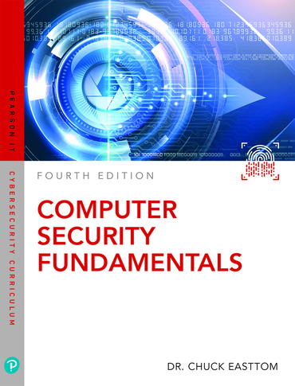

<h6>ver. June-2021.</h6>
<h2>IS-222 "Cybersecurity Fundamentals"</h2>
<h4 style="color:green"><i> Prof. Sangmork "SAM" Park (Col(R). ROKAF)</i></h4>
<h5><u><i>School of Arts and Science, Carolina University</i></u></h5>

<h4>Textbook:</h4> 

<em><u>[Chuck Easttom, 2019. "Computer Security Fundamentals 4th Edition", Pearson IT Certification](https://www.pearson.com/en-us/subject-catalog/p/computer-security-fundamentals/P200000000230/9780137459674)
</u></em>

<h4>Prerequisites (recommended):</h4>

-   Basic knowledge of Computer System

---

<h4>Course description</h4>

IS 222 is a basic level cybersecurity course that covers most of the cybersecurity related topics for the computer science student who has interests in cybersecurity studies and for the interdisciplinary student who needs knowledge on cybersecurity.

---

<h4>Course Schedule</h4>

<h5>Week-1: </h5>

-   Introduction to Computer Systems
    -   Intro. to Virtual Machine / Linux
    -   Lab Environment Setup
-   Intro. to Computer Security
    -   Types of Cyber Threats
    -   Cybersecurity Terminoloby
    -   Online Security Resources
-   Quiz#1, Project#1 (Lab environment setup)

<h5>Week-2: </h5>

-   Networks and the Internet
    -   Computer Nework Infrastructure
    -   Basic Network / Server Systems (Web, DB, FTP, SSH, Firewall, etc.)
-   Cybercrimes: Cyber Stalking, Fraud, and Abuse
-   Quiz#2, Rearch#1

<h5>Week-3: </h5>

-   Denial of Service Attacks
    -   Types of DOS Attacks
    -   Real-World Examples
-   Malwares
    -   Viruses, Worms, Trojan Horses, Spyware, etc.
-   Quiz#3, Report#2

<h5>Week-4: </h5>

-   Techinques Used by Hackers
    -   Scanning, SQL Injection, CSS, Wireless Attacks, etc.
    -   Dark Web
-   Industrial Espionage
-   Mid-term exam, Report#3

<h5>Week-5: </h5>

-   Encryption / Decryption
    -   History of Encryption / Decryption
    -   Modern Cryptography Methods
-   Computer Security Technology
    -   Computer Security Systems, Devices, and Tools
-   Quiz#4, Report#4

<h5>Week-6: </h5>

-   Cybersecurity Policies
-   Network Scanning and Vulnerability/Peneteration Testing

-   Quiz#5, Report#5

<h5>Week-7: </h5>

-   Cyber terrorism, Information Warfare
-   Cyber Detective, Computer Forensics
-   Final exam, Final Project/Report

---

<h4>References</h4>

1. [NIST CSRC: Computer Security Resource Center](https://csrc.nist.gov/)
2. [DHS CISA: Cybersecurity & Infrastructure Security Agency](https://www.cisa.gov/)
3. [USCYBERCOM: U.S. Cyber Command](https://www.cybercom.mil/)
