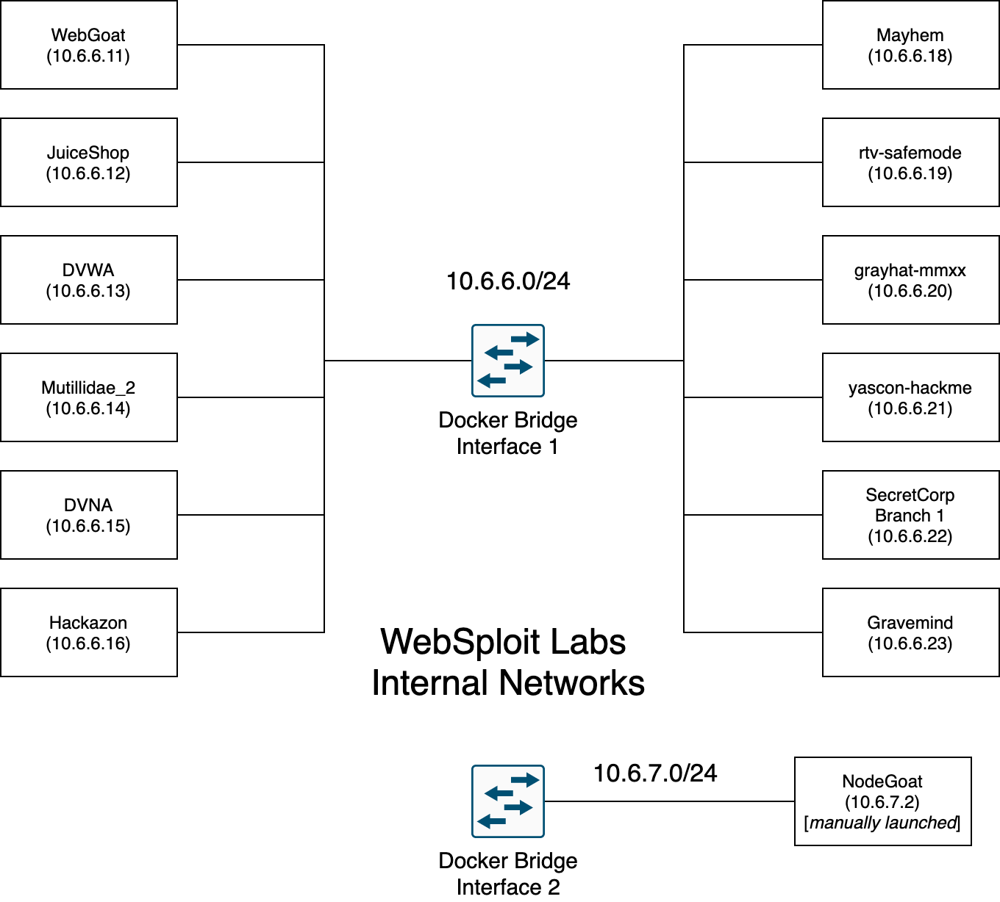

<h5><em>Update: July-2022</em></h5>

---

<h2>WebSploit Tutorial</h2>

---

##### [WebSploit Labs](https://websploit.org): A learning environment created by Omar Santos

<br/>

<!--  -->



---

<h4>1. Install</h4>

##### 1.1. Kali or Parrot OS: Installation on VM(Hypervisor) recommended.

##### 1.2. Run the WebSploit install script

```sh
curl -sSL https://websploit.org/install.sh | sudo bash

```

-   THis command install all the tools, Docker, the intentionally vulnerable containers, and numerous cybersecurity resoruces

<h4>2. Start</h4>

```sh
service docker start
sudo docker ps
```

<h4>3. Upgrade</h4>

```sh
weget https://websploit.org/update.sh
sudo bash update.sh

```
